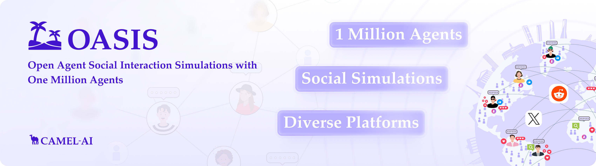
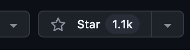
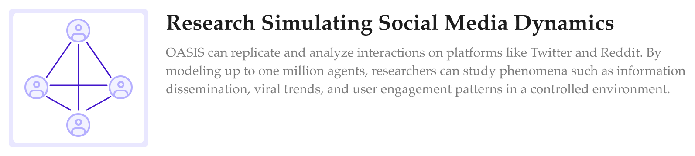
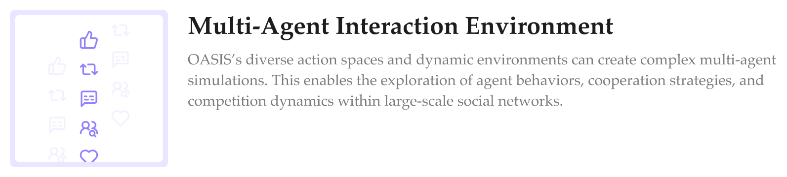
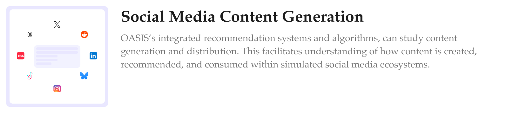
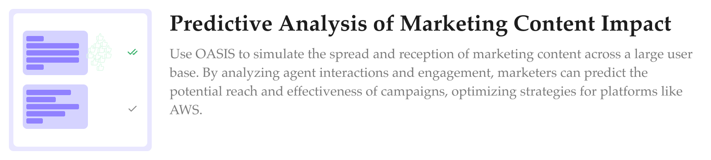
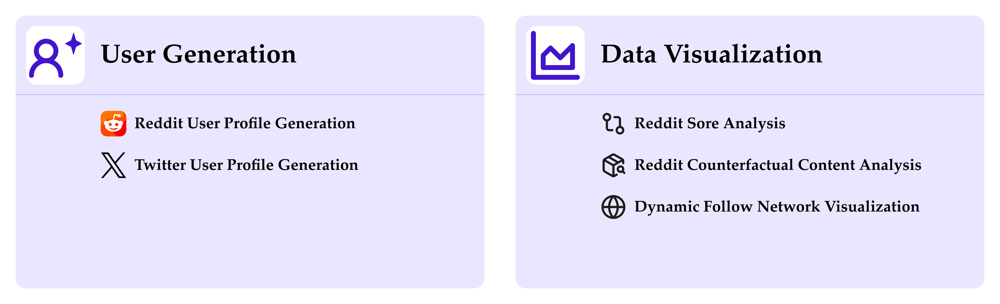

<div align="center">
  <a href="https://www.camel-ai.org/">
    
  </a>
</div>

</br>

<div align="center">

<h1> OASIS: Open Agent Social Interaction Simulations with One Million Agents
</h1>

[![Discord][discord-image]][discord-url]
[![X][x-image]][x-url]
[![Reddit][reddit-image]][reddit-url]
[![Wechat][wechat-image]][wechat-url]
[![Wechat][oasis-image]][oasis-url]
[![Hugging Face][huggingface-image]][huggingface-url]
[![Star][star-image]][star-url]
[![Package License][package-license-image]][package-license-url]


<h4 align="center">

[Community](https://github.com/camel-ai/camel#community) |
[Paper](https://arxiv.org/abs/2411.11581) |
[Examples](https://github.com/camel-ai/oasis/tree/main/scripts) |
[Dataset](https://huggingface.co/datasets/oasis-agent/oasis-dataset) |
[Citation](https://github.com/camel-ai/oasis#-citation) |
[Contributing](https://github.com/camel-ai/oasis#-contributing-to-oasis) |
[CAMEL-AI](https://www.camel-ai.org/)
</h4>

</div>

<br>

<p align="left">
  

🏝️ OASIS is a scalable, open-source social media simulator that integrates large language models with rule-based agents to realistically mimic the behavior of up to one million users on platforms like Twitter and Reddit. It's designed to facilitate the study of complex social phenomena such as information spread, group polarization, and herd behavior, offering a versatile tool for exploring diverse social dynamics and user interactions in digital environments.
</p>

<br>

<div align="center">
🌟 Star OASIS on GitHub and be instantly notified of new releases.
</div>

<br>

<div align="center">
    
  </a>
</div>

<br>

## ✨ Key Features

### 📈 Scalability
OASIS supports simulations of up to one million agents, enabling studies of social media dynamics at a scale comparable to real-world platforms.

### 📲 Dynamic Environments
Adapts to real-time changes in social networks and content, mirroring the fluid dynamics of platforms like Twitter and Reddit for authentic simulation experiences.

### 👍🏼 Diverse Action Spaces
Agents can perform 21 actions, such as following, commenting, and reposting, allowing for rich, multi-faceted interactions.

### 🔥 Integrated Recommendation Systems
Features interest-based and hot-score-based recommendation algorithms, simulating how users discover content and interact within social media platforms.

<br>

## 📺 Demo Video

### Introducing OASIS: Open Agent Social Interaction Simulations with One Million Agents

<video width="100%" controls>
  <source src="assets/oasis_introduction.mp4" type="video/mp4">
  Introducing OASIS: Open Agent Social Interaction Simulations with One Million Agents
</video>

<br>

For more showcaes:
- Can 1,000,000 AI agents simulate social media?
[→Watch demo](https://www.youtube.com/watch?v=lprGHqkApus&t=2s)

<br>

## 🎯 Usecase
<div align="left">
    
    
   <a href="http://www.matrix.eigent.ai">
    
   </a>
     
</div>

## ⚙️ Quick Start

### 1. Clone the Repository

```bash
git clone https://github.com/camel-ai/oasis.git

cd oasis
```

### 2. Create and Activate a Virtual Environment

Please choose one of the following methods to set up your environment. You only need to follow one of these methods.

- Option 1: Using Conda (Linux & macOS & windows)

```bash
conda create --name oasis python=3.10
conda activate oasis
```

- Option 2: Using venv (Linux & macOS)

```bash
python -m venv oasis-venv
source oasis-venv/bin/activate
```

- Option 3: Using venv (Windows)

```bash
python -m venv oasis-venv
oasis-venv\Scripts\activate
```

### 3. Install Necessary Packages

```bash
pip install --upgrade pip setuptools

pip install -e .  # This will install dependencies as specified in pyproject.toml
```

<br>

> [!TIP]
> For more detailed instructions and additional configuration options, check out the [installation section](tutorials/installation.md).

### More Tutorials

To discover how to create profiles for large-scale users, as well as how to visualize and analyze social simulation data once your experiment concludes, please refer to [More Tutorials](tutorials/tutorial.md) for detailed guidance.

<div align="center">
  
</div>


## 📢 News

###  Upcoming Features & Contributions
> We welcome community contributions! Join us in building these exciting features.

- [OASIS Refactor: First Release on PyPI](https://github.com/camel-ai/oasis/issues/57)
- [Write More Documents for OASIS](https://github.com/camel-ai/oasis/issues/60)

<!-- - Public release of our dataset on Hugging Face (November 05, 2024) -->

###  Latest Updates
- Support OPENAI Embedding model for Twhin-Bert Recommendation System. - 📆 March 25, 2025
- Updated social media links and QR codes in the README! Join OASIS & CAMEL on WeChat, X, Reddit, and Discord. - 📆 March 24, 2025
- Add multi-threading support to speed up LLM inference by 13x - 📆 March 4, 2025
- Slightly refactoring the database to add Quote Action and modify Repost Action - 📆 January 13, 2025
- Added the demo video and oasis's star history in the README - 📆 January 5, 2025
- Introduced an Electronic Mall on the Reddit platform - 📆 December 5, 2024
- OASIS initially released on arXiv - 📆 November 19, 2024
- OASIS GitHub repository initially launched - 📆 November 19, 2024


## 🥂 Contributing to OASIS🏝️

> We greatly appreciate your interest in contributing to our open-source initiative. To ensure a smooth collaboration and the success of contributions, we adhere to a set of contributing guidelines similar to those established by CAMEL. For a comprehensive understanding of the steps involved in contributing to our project, please refer to the CAMEL [contributing guidelines](https://github.com/camel-ai/camel/blob/master/CONTRIBUTING.md). 🤝🚀
>
>An essential part of contributing involves not only submitting new features with accompanying tests (and, ideally, examples) but also ensuring that these contributions pass our automated pytest suite. This approach helps us maintain the project's quality and reliability by verifying compatibility and functionality.
>

## 📬 Community & Contact

If you're keen on exploring new research opportunities or discoveries with our platform and wish to dive deeper or suggest new features, we're here to talk. Feel free to get in touch for more details at camel.ai.team@gmail.com.

<br>

- Join us ([*Discord*](https://discord.camel-ai.org/) or [*WeChat*](https://ghli.org/camel/wechat.png)) in pushing the boundaries of finding the scaling laws of agents. 

- Join WechatGroup for further discussions!
<div align="">
  
</div>


## 🌟 Star History

[](https://star-history.com/#camel-ai/oasis&Date)

## 🔗 Citation

```
@misc{yang2024oasisopenagentsocial,
      title={OASIS: Open Agent Social Interaction Simulations with One Million Agents},
      author={Ziyi Yang and Zaibin Zhang and Zirui Zheng and Yuxian Jiang and Ziyue Gan and Zhiyu Wang and Zijian Ling and Jinsong Chen and Martz Ma and Bowen Dong and Prateek Gupta and Shuyue Hu and Zhenfei Yin and Guohao Li and Xu Jia and Lijun Wang and Bernard Ghanem and Huchuan Lu and Chaochao Lu and Wanli Ouyang and Yu Qiao and Philip Torr and Jing Shao},
      year={2024},
      eprint={2411.11581},
      archivePrefix={arXiv},
      primaryClass={cs.CL},
      url={https://arxiv.org/abs/2411.11581},
}
```

## 🙌 Acknowledgment

We would like to thank Douglas for designing the logo of our project.

## 🖺 License

The source code is licensed under Apache 2.0.

[discord-image]: https://img.shields.io/discord/1082486657678311454?logo=discord&labelColor=%20%235462eb&logoColor=%20%23f5f5f5&color=%20%235462eb
[discord-url]: https://discord.camel-ai.org/
[huggingface-image]: https://img.shields.io/badge/%F0%9F%A4%97%20Hugging%20Face-CAMEL--AI-ffc107?color=ffc107&logoColor=white
[huggingface-url]: https://huggingface.co/camel-ai
[oasis-image]: https://img.shields.io/badge/WeChat-OASISProject-brightgreen?logo=wechat&logoColor=white
[oasis-url]: ./assets/oasis_wechat.jpg
[package-license-image]: https://img.shields.io/badge/License-Apache_2.0-blue.svg
[package-license-url]: https://github.com/camel-ai/oasis/blob/main/licenses/LICENSE
[reddit-image]: https://img.shields.io/reddit/subreddit-subscribers/CamelAI?style=plastic&logo=reddit&label=r%2FCAMEL&labelColor=white
[reddit-url]: https://www.reddit.com/r/CamelAI/
[star-image]: https://img.shields.io/github/stars/camel-ai/oasis?label=stars&logo=github&color=brightgreen
[star-url]: https://github.com/camel-ai/oasis/stargazers
[wechat-image]: https://img.shields.io/badge/WeChat-CamelAIOrg-brightgreen?logo=wechat&logoColor=white
[wechat-url]: ./assets/wechat.JPGwechat.jpg
[x-image]: https://img.shields.io/twitter/follow/CamelAIOrg?style=social
[x-url]: https://x.com/CamelAIOrg